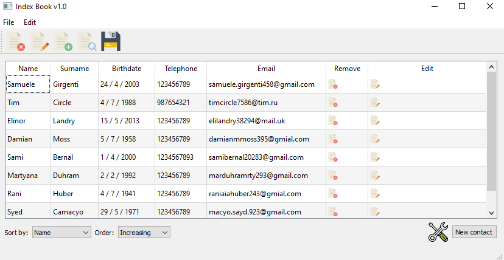
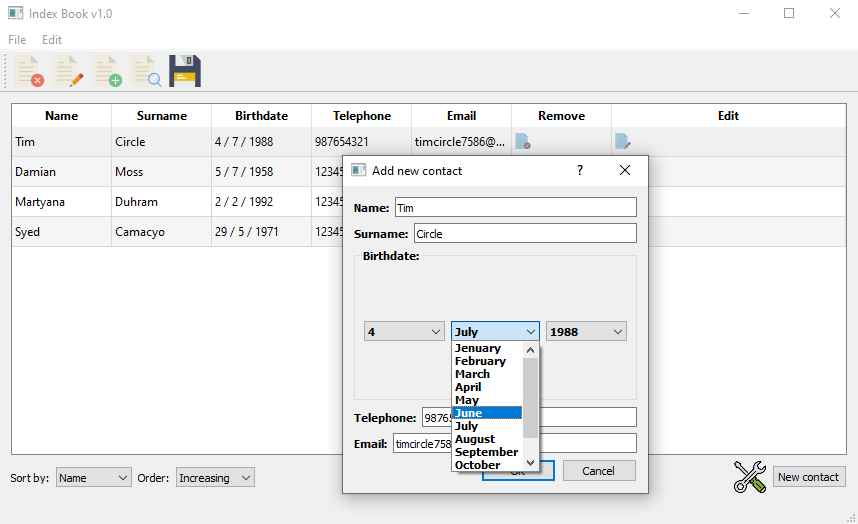

# IndexBook GUI
A simple IndexBook, with a graphic interface built in **C++/Qt**.

### Features

 - Fields stored: **name, surname, birthdate, email, telephone**.
 - Easy saving in text files.
 - Translations in **English** and **Italian**.

